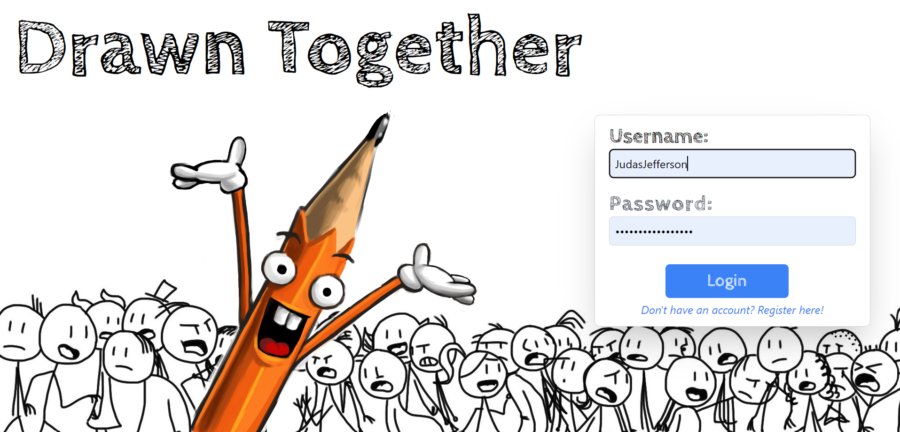
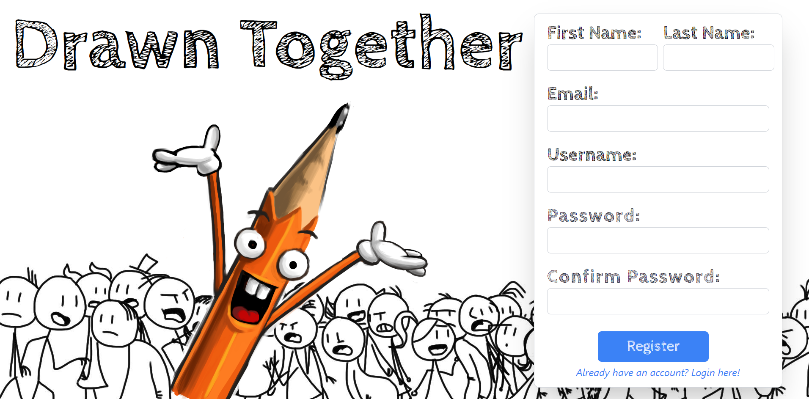
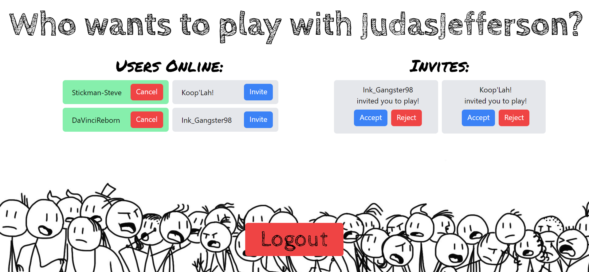
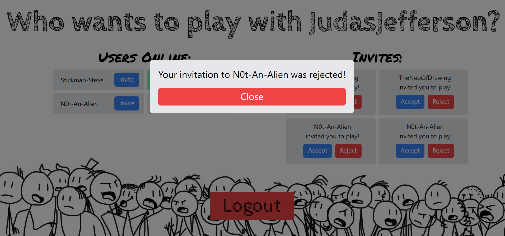
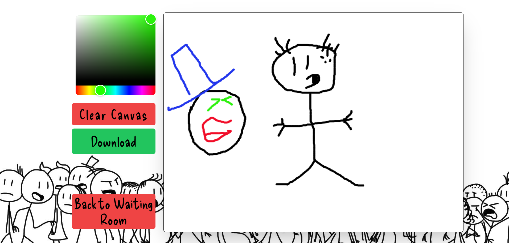
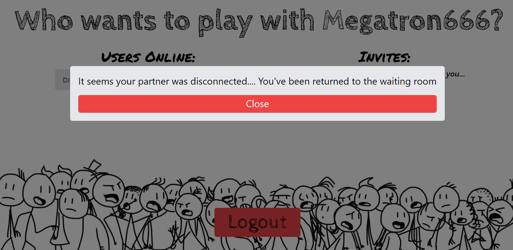

# Drawn Together (Frontend)

### NOTE:
*This is the frontend for my 'Drawn Together' project and requires access to the [Backend](https://github.com/TimBroderick44/Drawn-Together-Backend) and the [WebSocket Server](https://github.com/TimBroderick44/Drawn-Together-Websocket-Server).

The frontend provides an interactive interface for users to draw together in real time. It handles user authentication, drawing interactions, and communication with the backend and WebSocket server.

## Welcome to Drawn Together!

## Join in on the fun! Register as a new user!

## Join in with friends!

## ... Well, this is awkward.

## Draw together in real time.

## .... Where'd they go?


## Technologies Used

- **Frontend Framework**: React with TypeScript
- **Styling**: Tailwind CSS
- **State Management**: React Hooks
- **WebSocket**: socket.io-client

## Highlights

- **TypeScript**: Ensured type safety and improved code maintainability by using TypeScript.
- **Tailwind CSS**: First time using Tailwind CSS for styling, which allowed for rapid and responsive design.
- **Custom Hooks**: Created a custom `useDraw` hook to handle drawing logic.
- **WebSocket Integration**: Utilized WebSockets to enable real-time drawing interactions.

## Build Steps

1. **Clone the repository**:
   ```bash
   git clone https://github.com/TimBroderick44/Drawn-Together-Frontend.git
   cd Drawn-Together-Frontend
   ```

2. **Install dependencies**:
   ```bash
   npm install
   ```
3. **Start the development server**:
   ```bash
   npm run dev
   ```
4. **Put it all together**:
   - Ensure the [Backend](https://github.com/TimBroderick44/Drawn-Together-Backend) and [WebSocket Server](https://github.com/TimBroderick44/Drawn-Together-Websocket-Server) have been implemented and are running.

## Lessons Learnt:

### TypeScript:
Having used Typescript a few times now, I am more comfortable with it. I am beginning to appreciate the benefits of type safety and how it can improve code quality and maintainability.

### Tailwind CSS:
This was the first time using Tailwind CSS and I wish I had started using it earlier. It significantly sped up styling. I have been converted.

### Custom Hooks:
Creating the `useDraw` hook was a great learning experience. It encapsulated the drawing logic, making the component code cleaner and more manageable.

### WebSocket Integration:
Integrating WebSockets with `socket.io-client` allowed for real-time drawing interactions between users. In conjunction with the websocket server, it was a great learning experience.

## What I still need to do:
### Gamification of the project:
- [ ] Allow users to take turns drawing and guessing various words.
- [ ] Implement a scoring system.
- [ ] Add a timer for each turn.
- [ ] Add a chat feature.

## Thank You!

Thank you for taking the time to look at this project. I really hope you enjoy it.  
Feel free to reach out and ask any questions.

[Tim Broderick]

